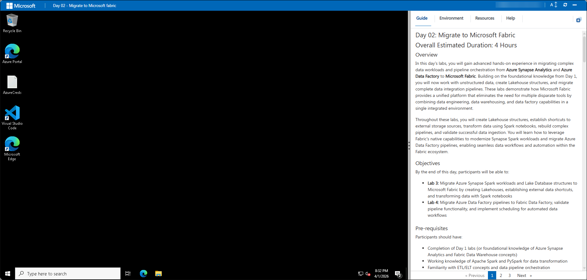

# Day 02: Migrate to Microsoft Fabric

## Overall Estimated Duration: 4 Hours

### Overview

In this hands-on labs, you will gain advanced hands-on experience in migrating complex data workloads and pipeline orchestration from **Azure Synapse Analytics** and **Azure Data Factory** to **Microsoft Fabric**. Building on the foundational knowledge from Day 1, you will now work with unstructured data, create Lakehouse structures, and migrate complete data integration pipelines. These labs demonstrate how Microsoft Fabric provides a unified platform that eliminates the need for multiple disparate tools by combining data engineering, data warehousing, and data factory capabilities in a single integrated environment.

Throughout these labs, you will create Lakehouse structures, establish shortcuts to external storage sources, transform data using Spark notebooks, rebuild complex pipelines, and validate successful data ingestion. You will learn how to leverage Fabric's native capabilities to modernize Synapse Spark workloads and migrate Azure Data Factory pipelines, enabling seamless data workflows and automation within the Fabric ecosystem.

### Objectives

By the end of this day, participants will be able to:

- **Lab 3:** Migrate Azure Synapse Spark workloads and Lake Database structures to Microsoft Fabric by creating Lakehouses, establishing external data shortcuts, and transforming data with Spark notebooks
- **Lab 4:** Migrate Azure Data Factory pipelines to Fabric Data Factory, validate pipeline functionality, and implement scheduling for automated data workflows

### Pre-requisites

Participants should have:

- Completion of Day 1 labs (or foundational knowledge of Azure Synapse Analytics and Fabric Data Warehouse concepts)
- Working knowledge of Apache Spark and PySpark for data transformation
- Familiarity with ETL/ELT concepts and data pipeline orchestration
- Understanding of unstructured and semi-structured data handling (CSV, Parquet, Delta formats)
- Experience with cloud storage concepts including Azure Data Lake Storage Gen2 (ADLS Gen2)
- Basic understanding of Python for data manipulation and transformation tasks

### Explanation of Components

The architecture for this day's labs involves the following key components:

**Azure Synapse Analytics - Spark Pool:** The source for big data processing providing:
- Apache Spark clusters for distributed data processing
- PySpark notebooks for data transformation and analysis
- Integration with Azure Data Lake Storage Gen2 for large-scale data storage
- Spark SQL for querying distributed data

**Azure Data Factory (ADF):** The source data orchestration platform providing:
- Pipeline orchestration and scheduling capabilities
- Copy data activities for data movement across systems
- Linked services for connecting to multiple data sources
- Trigger-based and schedule-based pipeline execution

**Microsoft Fabric Lakehouse:** The unified data engine providing:
- Delta table format for ACID-compliant structured data
- Native Spark integration for data transformation
- Support for both structured and unstructured data
- SQL endpoint for querying lakehouse data
- Automatic schema management and data versioning

**Fabric Data Factory (Pipelines):** Provides orchestration capabilities including:
- Copy data activities for batch data ingestion
- Support for multiple data sources and destinations
- Scheduling and trigger-based execution
- OneLake integration for seamless data storage
- Pipeline monitoring and error handling

**External Data Shortcuts:** Enable efficient data access by:
- Creating virtual references to external storage (ADLS Gen2, S3)
- Avoiding data duplication and reducing storage costs
- Allowing transformation of external data within Fabric
- Supporting both read and write operations to external sources

**Spark Notebooks:** Provide interactive data processing through:
- PySpark/Scala for distributed data transformation
- DataFrame operations for efficient data manipulation
- Integration with Lakehouse tables for persistent storage
- Support for multi-language code cells (Python, SQL, Scala)

**OneLake:** Fabric's unified data lake providing:
- Centralized storage for all Fabric workloads
- Automatic data organization and optimization
- Integration across Lakehouse, Warehouse, and other services
- Support for Shortcuts to external data sources

---

## Getting Started with the lab

Welcome to your Migrate to Microsoft Fabric Workshop - Day 2. Let's continue by making the most of this experience.

## Accessing Your Lab Environment

Once you're ready to dive in, your virtual machine and **Guide** will be right at your fingertips within your web browser.

## Lab Guide Zoom In/Zoom Out

To adjust the zoom level for the environment page, click the **A↕ : 100%** icon located next to the timer in the lab environment.

## Virtual Machine & Lab Guide

Your virtual machine is your workhorse throughout the workshop. The lab guide is your roadmap to success.

## Exploring Your Lab Resources

To get a better understanding of your lab resources and credentials, navigate to the **Environment** tab.

## Utilizing the Split Window Feature

For convenience, you can open the lab guide in a separate window by selecting the **Split Window** button from the Top right corner.

## Managing Your Virtual Machine

Feel free to **Start, Stop, or Restart (2)** your virtual machine as needed from the **Resources (1)** tab. Your experience is in your hands!

## Let's Get Started with Azure Portal

1. On your virtual machine, click on the Azure Portal icon.

2. You'll see the **Sign into Microsoft Azure** tab. Here, enter your **credentials (1)** and select **Next (2)**:

   - **Email/Username:** <inject key="AzureAdUserEmail"></inject>

     

3. Next, provide your **password (1)** and select **Sign In (2)**:

   - **Password:** <inject key="AzureAdUserPassword"></inject>

     

      >**Note:** If you see **Temporary Access pass**, enter the the password and select **Sign In (2)**:

       - Enter **Temporary Access Pass:** <inject key="AzureAdUserPassword"></inject> **(1)**

          

4. If **Action required** pop-up window appears, click on **Ask later**.

5. If prompted to **stay signed in**, you can click **No**.

6. If a **Welcome to Microsoft Azure** pop-up window appears, simply click **"Cancel"** to skip the tour.

7. If a **Welcome to Microsoft Azure** pop-up window appears, simply click "Maybe Later" to skip the tour.

## Support Contact

The CloudLabs support team is available 24/7, 365 days a year, via email and live chat to ensure seamless assistance at any time. We offer dedicated support channels tailored specifically for both learners and instructors, ensuring that all your needs are promptly and efficiently addressed.

Learner Support Contacts:

- Email Support: [cloudlabs-support@spektrasystems.com](mailto:cloudlabs-support@spektrasystems.com)
- Live Chat Support: https://cloudlabs.ai/labs-support

Click **Next** from the bottom right corner to embark on your Lab journey!

Now you're all set to explore the powerful world of technology. Feel free to reach out if you have any questions along the way. Enjoy your workshop!
